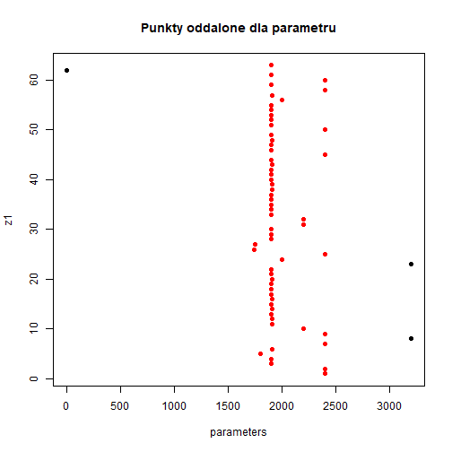
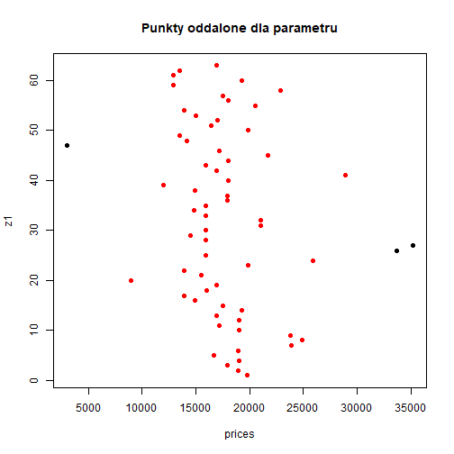
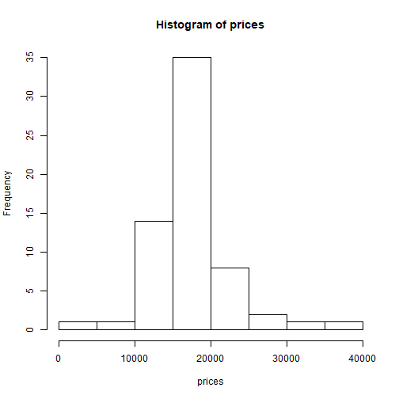
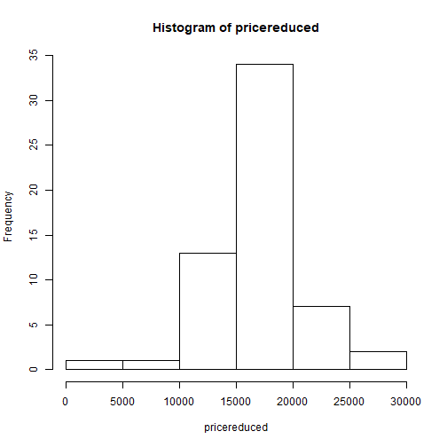
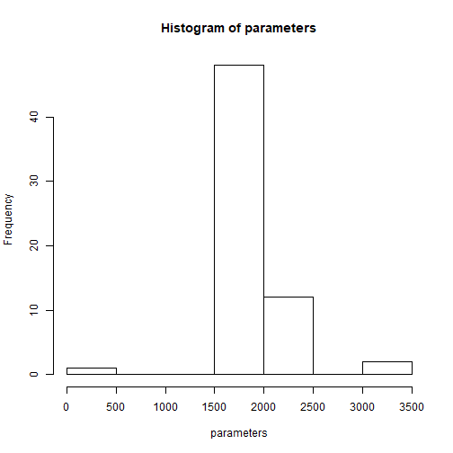
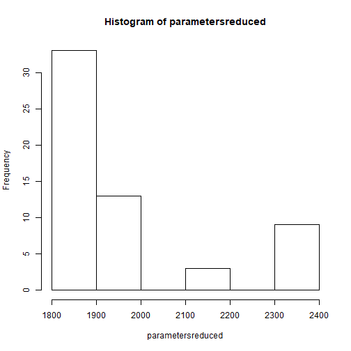
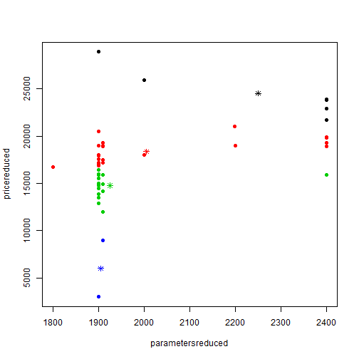
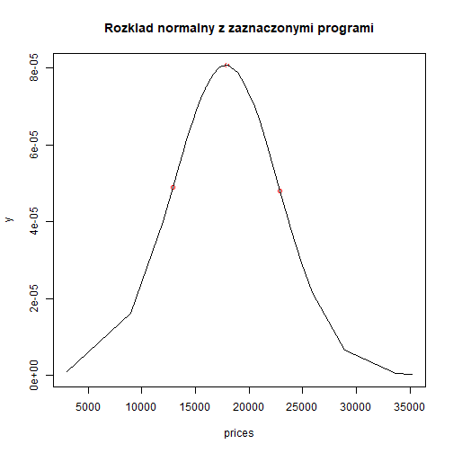

# 1. Raport z analizy danych z kategorii i w czasie:


```
## Error in eval(expr, envir, enclos): object 'params' not found
```

```
## [1] "Wed Dec 19 12:49:03 2018"
```


# 2. Przygotowanie danych

Najpierw został przeprowadzony etap czyszczenia danych z wartości błędnych i odrzucaniem punktów oddalonych (większych niż 3-krotność odchylenia standardowego od wartości średniej).
Na poniższej grafice znajdziemy wykres pokazujący te punkty:

## a) dla parametru




## b) dla ceny




# 3. Histogramy, tablice rozkładu wystąpień
## a) dla ceny, przed transformacją


## b) dla ceny, po transformacji



## c) dla parametrów przed transformacją



## d) dla parametrów po transformacji




# 4. Grupowanie danych

Grupowanie danych przebiegało za pomocą metody k-średnich, służy znalezieniu grup potencjalnej konkurencji w sprzedaży, jak i ogólnemu zarysowaniu rynku i liczności grup.



# 5. Selekcja cen potencjalnych

Na poniższym wykresie znajdziemy rozkład normalny po transformacji oraz zaznaczone punkty, które zostały wyliczone jako wartości potencjalnie istotne dla użytkownika.



# 6. Wartości cen potencjalncych

Zostały wyliczone następujące wartości dla cen jako wartości przewidywalne:

### a) Wartość minimalna


```
## [1] 12908.45
```

Wartość, dla której przedmiot aukcji sprzeda sie błyskawicznie, w tej kategorii cenowej jest największy popyt na wybrany rodzaj produktu. Wiąże się to jednak ze stosunkowo małym zarobkiem.

### b) Wartość potencjalnie najlepsza


```
## [1] 17855.49
```

Jest to wartość, która gwarantuje sprzedaż produktu, nie w czasie błyskawicznym, ale po odczekaniu pewnej chwili oraz posiada większy zysk niż wartość pierwsza, jest to wartość najrozsądniejsza dla kupca, jeżeli nie zależy mu tak bardzo na błyskawicznej sprzedaży, ale chce być pewny że przedmiot zostanie przez kogoś kupiony.

### c) Wartość z ryzykiem


```
## [1] 22802.53
```

Po wystawieniu do tej ceny, istnieje jeszcze szansa, że nasz produkt się sprzeda. Jednak będzie to zapewne wiązało się z długim czasem oczekiwania na sprzedaż produktu, oraz nie mamy zagwarantowane, że tak będzie. Powyżej tej kwoty jest bardzo ciężko sprzedać produkt.
